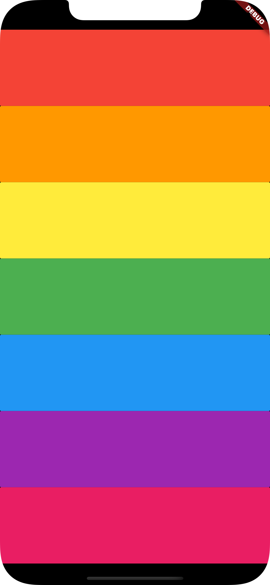

# practice_flutter

# Flutter Exercises

> Full disclaimer: I didn't get to the end on all of them, mostly because of lack of time. If there is anyone who considers them relevant for their work, please ping me or open an issue and I'll finish the implementation. Thanks for your understanding.

> This repo could change over time as I add different exercises or snippets

## Mi Card

-   Small app as a business card

[README](mi_card/README.md)

## Todoey

-   Small app as a todo list

[README](todoey/README.md)

## BMI Calculator

-   Small app for BMI calculation

[README](bmi_calculator/README.md)

## Clima

-   Small app to show & retrieve weather information in different cities

[README](clima/README.md)

## Crypto Ticker

-   Small app to show & retrieve crypto values

[README](cryptoticker/README.md)

## Dicey

-   Small app for dice simulation

[README](dicee/README.md)

## Trivia quizzler

-   Small app for xylophone simulation

[README](quizzler/README.md)

## Xylophone

-   Small app for xylophone simulation

[README](xylophone/README.md)

## I Am Rich

-   Small app to show my richness

[README](i_am_rich/README.md)

